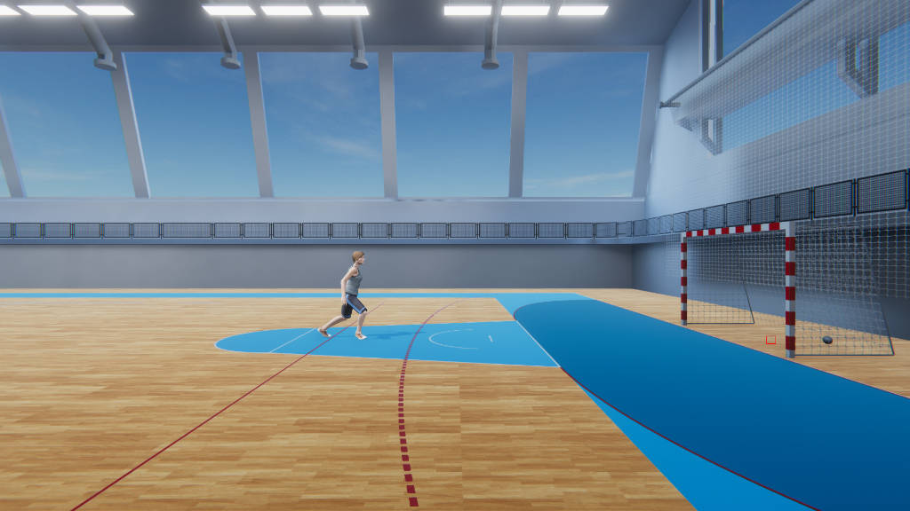

# 3D models and other assets.
This repository containst the 3D models used in the paper [Object Detection Using Synthesized Data](https://proceedings.ictinnovations.org/2019/paper/517/object-detection-using-synthesized-data)

## Sports court
A 3D model of a indoor sports court.

(https://raw.githubusercontent.com/../dvorana_preview.jpg)

## Jump shot model
Animation of a handball jump-shot.

## Citation
If you find this work useful for your research, please cite our paper:

    @article{buric2019object,
    title={Object Detection Using Synthesized Data}
    author={Buric, Matija and Paulin, Goran and Ivasic-Kos, Marina}
    journal={ICT Innovations 2019, Web Proceedings}
    pages={110--124}
    year={2019}
    }

## Acknowldegment
This research was fully supported by the Croatian Science Foundation under the project 
IP-2016-06-8345 “Automatic recognition of actions and activities in multimedia content from the sports domain” (RAASS) and by the University of Rijeka under the project number 18-222-1385

## License
 This work is licensed under a <a rel="license" href="http://creativecommons.org/licenses/by-nc-sa/4.0/">Creative Commons Attribution-NonCommercial-ShareAlike 4.0 International License</a>.
